# Instance-Based-Image-Retrieval

## Table of Contents
<center>

| No |   Title   |  
| :--- | :----------------------: | 
| 1. |   [Project Overview](#Project-Overview) |   
| 2. |[Datasets](#Datasets)|   
| 3.  |  [Methodology](#Methodology)  | 
| 5.  |    [Models and Baseline](#Models-and-Baseline)   | 
| 6.  |    [Evaluation Metrics and Results](#Evaluation-Metrics-and-Results)   | 
| 7.  |    [Code Instructions](#Code-Instructions)   | 
| 8.  |    [Interpretation of Results](#Interpretation-of-Results)   | 
| 9.  |    [References](#References)   | 
| 10.  |    [Project Team Members](#Project-Team-Members)   | 

</center>

## Project Overview

This project is done as a part of `Information Retrieval Course` Course.
we implemented two papers [**Bags of Local Convolutional Features for Scalable Instance Search**](https://arxiv.org/pdf/1604.04653.pdf) and [**Faster R-CNN Features for Instance Search**](https://www.cv-foundation.org/openaccess/content_cvpr_2016_workshops/w12/papers/Salvador_Faster_R-CNN_Features_CVPR_2016_paper.pdf).

We proposed an approach to solve the problem of **Instance Retrieval**. In Instance Retrieval task, we retrieve images from
the database based upon a instance in the query or input image.

                  Fig 1. Task of Instance Based Retrieval (query followed by retrieved images)

<div align="center">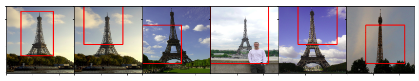</div>

<p>&nbsp;</p>

In this project, our aim is to retrieve images very similar to the query image and containing the given instance. We show an in breadth & depth analysis of the models developed over four widely known datasets **Oxford, Paris, Instre, Sculpture** and comparison of different similarity measures: **cosine and weighted cosine**. We evaluate the performance using three architectures: **ML Baseline using SIFT features, DL Bag of Words model and DL Faster CNN and Bow based model** along with metrics such as **Mean Average Precision** and **Normalized Discounted Cumulative Gain**.  

Project Poster can be found in [IR-Poster-Final.pdf](IR-Poster-Final.pdf).

Project Report can be found in [IR_Project_EndTerm_Report.pdf](IR_Project_EndTerm_Report.pdf).

## Datasets 

The four datasets used are : 
- [Paris Dataset](https://www.robots.ox.ac.uk/~vgg/data/parisbuildings/) :- This dataset contains 6412 images of 12
different landmarks of Paris, it was extracted from Flickr.
- [Oxford Dataset](https://www.robots.ox.ac.uk/~vgg/data/oxbuildings/) :- This dataset contains 5042 images of
11 different Oxford buildings, collected from Flickr.
- [Instre Dataset](http://123.57.42.89/instre/home.html) :- This is set of Datasets containing
different pictures of architectures, buildings,toys, designs,
paintings etc. There are three divisions of this dataset S1, S2
and M.INSTRE-S1 and INSTRE-S2 contains 11011 images
12059 images respectively. Different objects/designs/scenes
are annotated using bounding boxes. We have used **S1** from Instre dataset. 
- [Sculpture Dataset](https://www.robots.ox.ac.uk/~vgg/data/sculptures6k/) :- This dataset contains pictures of
sculptures taken by Henry Moore and Auguste Rodin. It
contains 6k images. The dataset is taken from Flickr.

                                   Fig 2. Datasets

<div align="center">
 <table>
  <tr>
    <td>Paris Dataset</td>
     <td>Instre Dataset</td>
     <td>Oxford Dataset</td>
     <td>Sculpture Dataset</td>
  </tr>
  <tr>
    <td>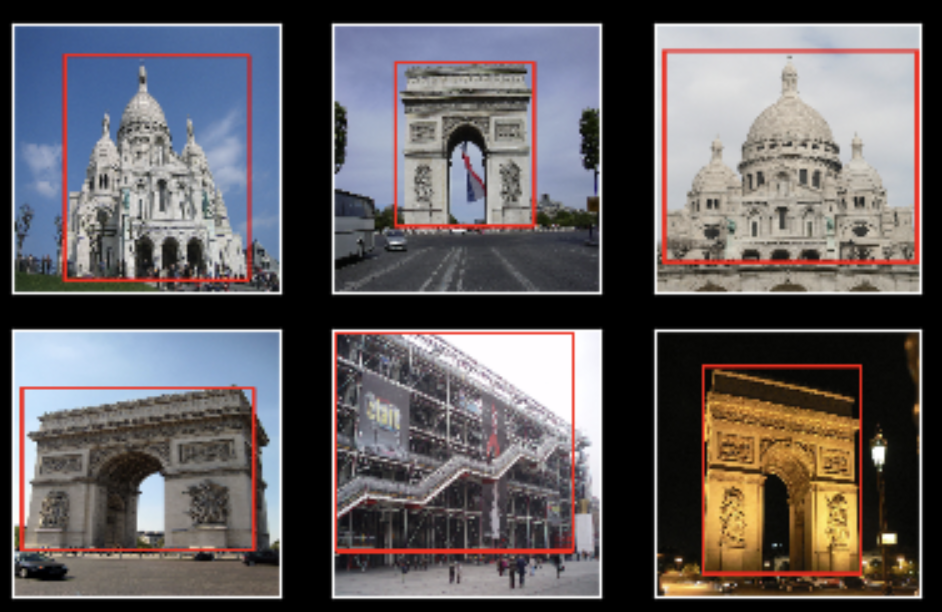</td>
    <td>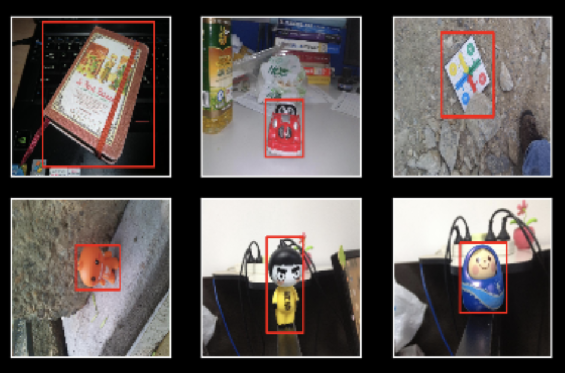</td>
    <td>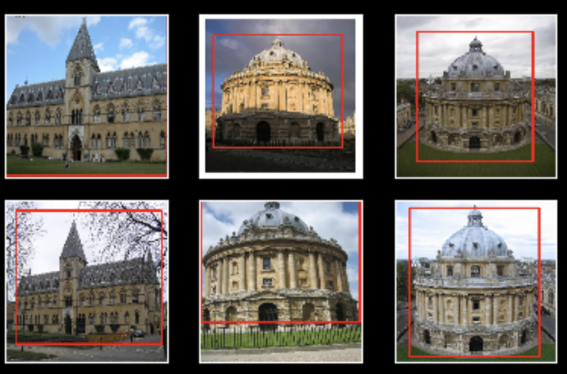</td>
    <td>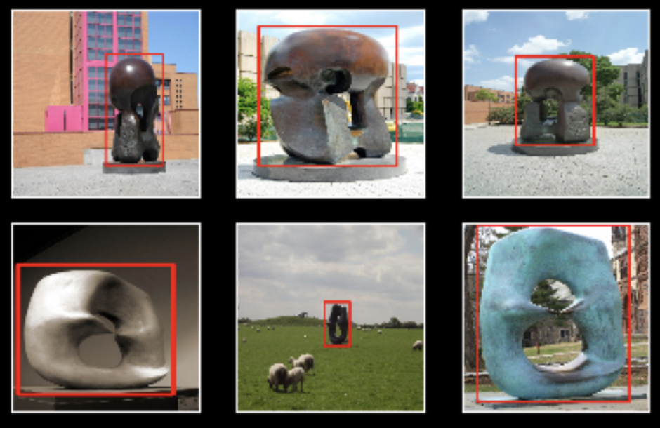</td>
  </tr>
 </table>
</div>
 

## Methodology
- Image Representation 
    - **Bag of Visual Words Representation**
        - Extraction of Features from Images using Feature extraction techniques like SIFT or CNN for feature extraction. 
        - Apply K-Means Clustering on on all images features and select P clusters as Visual Words.
        - Assign closest visual word to each pixel of dataset images.
        - Represent each image as Bag of Word of Visual Words.
    
    - **Faster RCNN Representation** 
        - Pre trained model [**fasterrcnn_resnet50_fpn**](https://pytorch.org/vision/stable/_modules/torchvision/models/detection/faster_rcnn.html) from Pytorch is used for image features generation. 
        - Following the paper [Faster R-CNN Features for Instance Search](https://www.cv-foundation.org/openaccess/content_cvpr_2016_workshops/w12/papers/Salvador_Faster_R-CNN_Features_CVPR_2016_paper.pdf) to get 
        global image descriptor from Faster R-CNN layer activations
        all layers in the network that operate with object proposals must be ignored and features should be extracted from the last convolutional layer. So we extracted features from **model.backbone.fpn.layer_blocks[3] layer of fasterrcnn_resnet50_fpn**

       
        


                                   Fig 3. Bag of Visual Words generation steps


<div align="center">
 <table>
  <tr>
    <td>Extract Image features</td>
     <td>Performs K means clustering for K visual words</td>
     <td>Generate Histograms (mapping each feature of image to one centroid among k) to get bow representation</td>
  </tr>
  <tr>
    <td>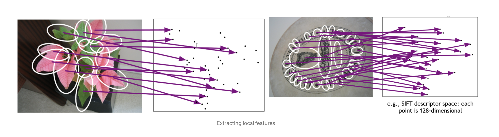</td>
    <td>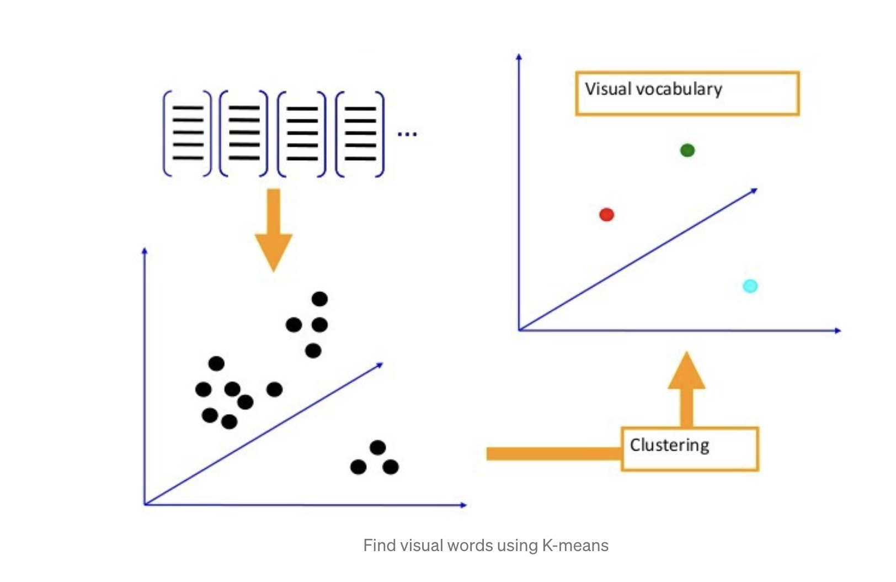</td>
    <td>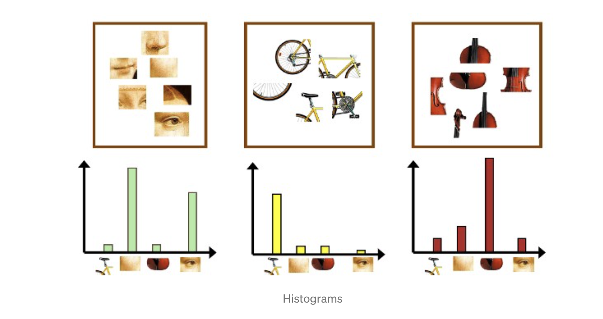</td>
  </tr>
 </table> 
</div>


- Retrieval Methodology 
    - For Instance Based Retrieval methods two way searching techniques are used : **Global search** and **Local search**. 
    Using global search top N images are obtained which are similar to the overall query image and using local search re-ranking is done over the top N images based on presence of instance in each image. 
    - **Global Ranking** : From obtained image representations of query image and database images perform similarly between them using cosine or weighted cosine similarity to get the top N matching images having highest similarity with query image. 
    -  **Local search or Spatial reranking** usually involves the usage of sliding windows at different scales and aspect ratios over an image. Each window is then compared to the query instance in order to find the optimal location that contains the query,which requires the computation of a visual descriptor on each of the considered windows.
        - For Local search first extract the features for the instance in query image (features only for image inside bounding box).
        - Slide windows of variable size over the image representation of database image and each time perform similarity matching between current window features and instance features from query image.  
        - The location of window in a database image which gives highest similarity will possibly contain the instance required and using this maximum similarity for each database image, re-rank top N images.
        - Different window sizes are slided over database image to incur the possibility of instance with variable sizes. 
    - Return the reranked results as retrieved images.

             Fig 4. Image Retrieval Steps : Global Ranking selecting top N images

<div align="center">
 <table>
  <tr>
    <td>Global Search with similarity matching</td>
    <td>Global Search output top N images selected</td>
    
  </tr>
  <tr>
    <td>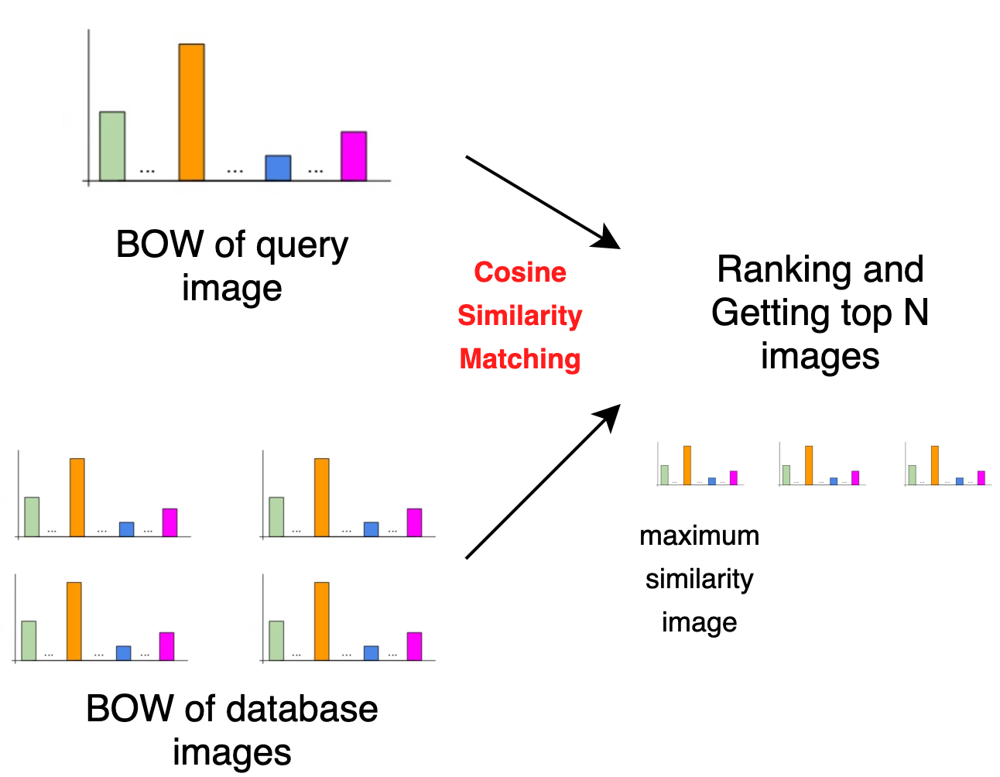</td>
    <td>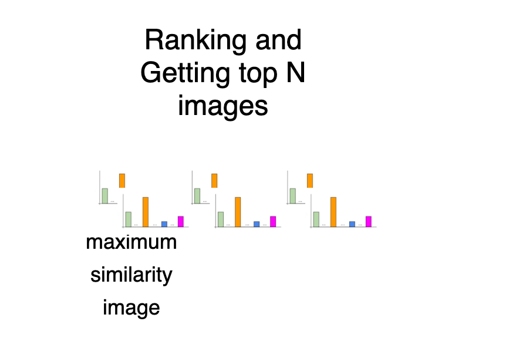</td>
    
  </tr>
 </table> 
</div>
 

                        Fig 5. Image Retrieval Steps : Local Search

<div align="center">
 <table>
  <tr>
    <td>Matching Instance & Window features from query & database images</td>
    <td>Reranking Top N images</td>
   
  </tr>
  <tr>
    <td>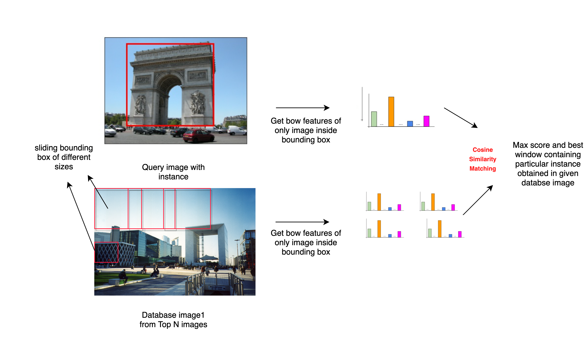</td>
    <td>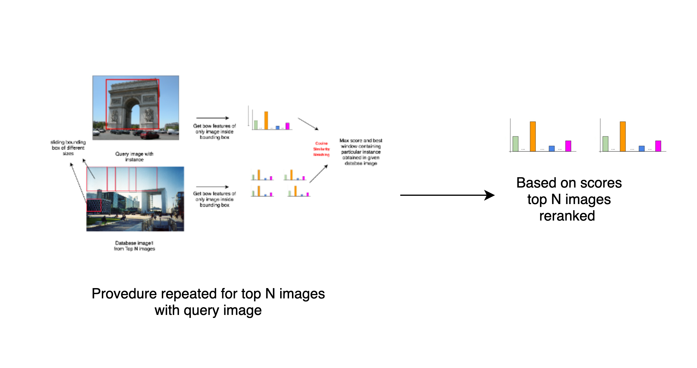</td>
  </tr>
 </table>  

</div>


## Models and Baseline

### ML Based Baseline 
- SIFT technique used to find the salient features in the image.
- K Mean Clustering done on all features of all images to get K visual words. 
- Each image represented as Bag of Words. 
- Retrieve images which are having highest Cosine similarity of BoW with that of query image are highest. 
- Select top N images and re-rank them by finding cosine similarity within BoW of query image containing instance with sliding windows of that of top N images. 
- This arranges the image containing the query instance in top rankings. 

                        Fig 6. ML Baseline Instance Retrieval 

<div align="center">
 <table>
  <tr>
    <td>BOW representation using SIFT</td>
    <td>Global Search then Local search mentioned in fig 5</td>
   
  </tr>
  <tr>
    <td></td>
    <td>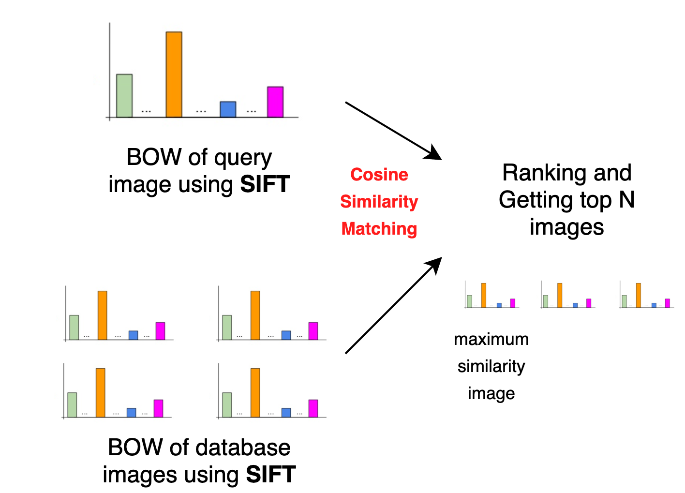</td>
  </tr>
 </table>  

</div>

### DL Bag of Words Based Model 
-  Implemented [**Bags of Local Convolutional Features for Scalable Instance Search**](https://arxiv.org/pdf/1604.04653.pdf)
- Bag of Words and Assignment Map Generation 
    - Features extracted using pretrained VGG-16 from the last convolutional layer removing classifier layers **output (512,7,7)**. Additional convolutional layer added to reduce computation **output (250,7,7)**. 
    - Global features or Histograms per image obtained by : 
        - Output (250,7,7) processed to (250,7*7) followed by transpose (49,250) per image that means one data point for KNN has 250 features. 
        - Matrix (49,250) obtained for each image and appended,then KNN applied to all data points obtained from each image. 
        - For Assignment map generation each row in matrix (49,250) is mapped to one visual word (KNN centers with 250 features) obtained from KNN, and final array converted to shape (7,7)
        - From a given Assignment Map, a histogram can be generated based upon how many times a visual word occurs in the map. 
        - Generated histogram is called BOW representation for image. 
- Each image represented as Bag of Words. 
- Retrieve images which are having highest Cosine similarity of BoW with that of query image are highest. 
- Select top N images and re-rank them by finding cosine similarity within **BoW of query image containing instance** with sliding windows of that of top N images. 
    - **BoW of query image containing instance**  can be obtained by simply mapping the bounding box coordinates scaled from Image(224,224) to Assignment Map(7,7) and then find histogram from the features obtained respective to only instance inside assignment map.
    - Similarly by sliding window over Assignment map of database image and getting window features its window histogram calculated. 
    - Perform Similarity matching on both histograms (bow of query with instance and bow of window in database image)  
    - Maximum scores per image for max score giving window respectively for each image are sorted to rerank top N images. 
- This arranges the image containing the query instance in top rankings. 


                    Fig 7. and 8. DL Bag of Words Based Instance Retrieval 


<div align="center">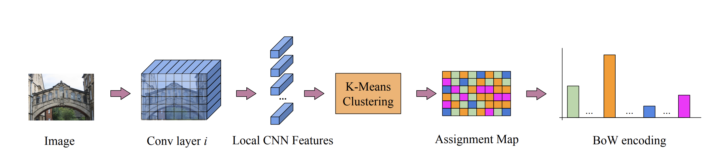</div>
<div align="center">
 <table>
  <tr>
    <td>Global Search</td>
    <td>Local Search</td>
  </tr>
  <tr>
    <td></td>
    <td></td>
  </tr>
 </table>  
</div>


### DL Bag of Words and Faster RCNN Based Model 
_ Based on [**Faster R-CNN Features for Instance Search**](https://www.cv-foundation.org/openaccess/content_cvpr_2016_workshops/w12/papers/Salvador_Faster_R-CNN_Features_CVPR_2016_paper.pdf).
- Completely Similar to DL Bag of Words model only Global ranking obtained using Faster RCNN. 
    - **Global Ranking or Global search**
        - Image passed into pretrained **fasterrcnn_resnet50_fpn** and global features extracted from **model.backbone.fpn.layer_blocks[3] layer of fasterrcnn_resnet50_fpn**
        - Similarity performed between query and database global features for Global Ranking. 
    - **Local Ranking**
        - Same procedure us DL Bag of Words model and for respective dataset same KNN centers used as used in DL BOW model. 

                    Fig 9. DL Bag of Words and Faster RCNN Based Instance Retrieval 

<div align="center">
 <table>
  <tr>
    <td>Global Search using Faster RCNN</td>
    
  </tr>
  <tr>
    <td>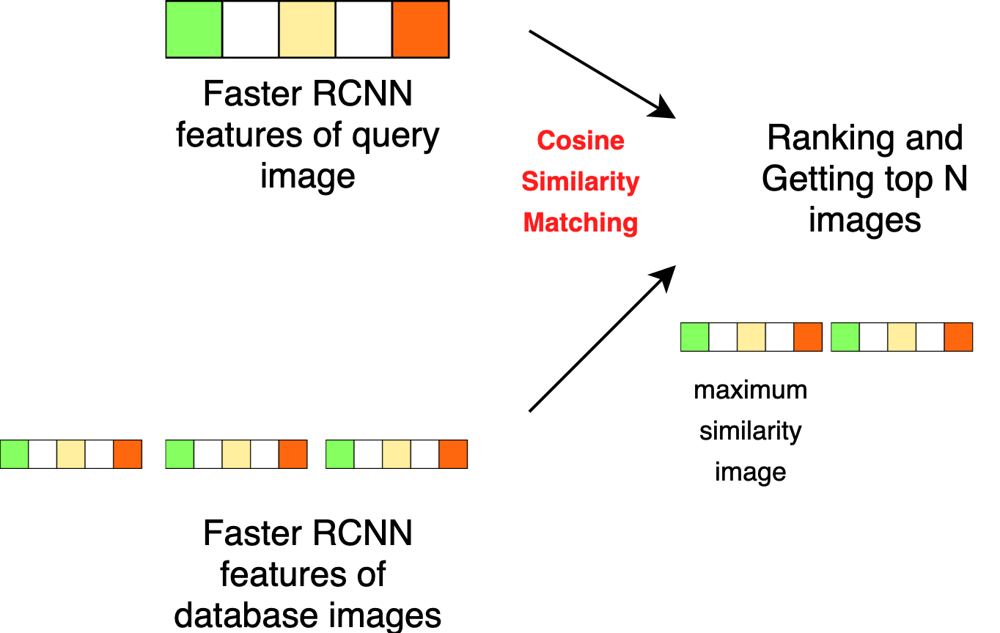</td>
    
  </tr>
 </table>  

</div>


## Evaluation Metrics and Results

Following are the results of the project:

                             Fig 10. ML Baseline Results
   <div align="center">

<table>
  <tr>
    <td>Cosine Similarity Results</td>
    <td>Weighted Cosine Similarity Results</td>
    
  </tr>
  <tr>
    <td>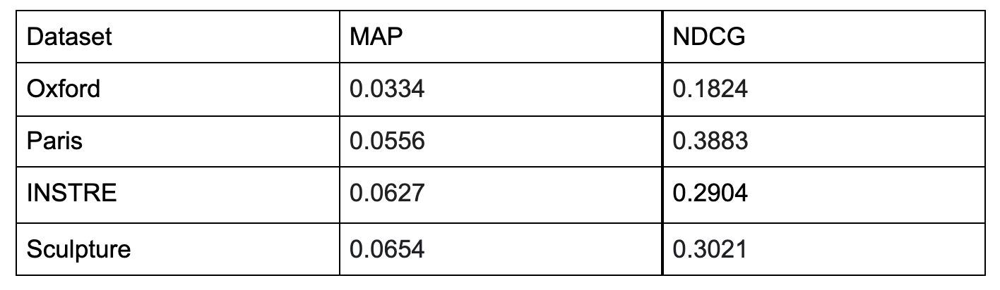</td>
    <td>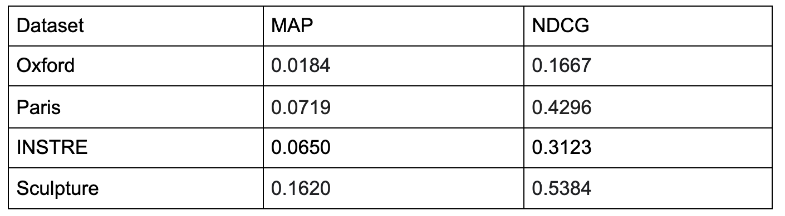</td>
    
  </tr>
 </table> 
 
  </div>   

                               Fig 11. DL BOW Model Results
   <div align="center">

<table>
  <tr>
    <td>Cosine Similarity Results</td>
    <td>Weighted Cosine Similarity Results</td>
    
  </tr>
  <tr>
    <td>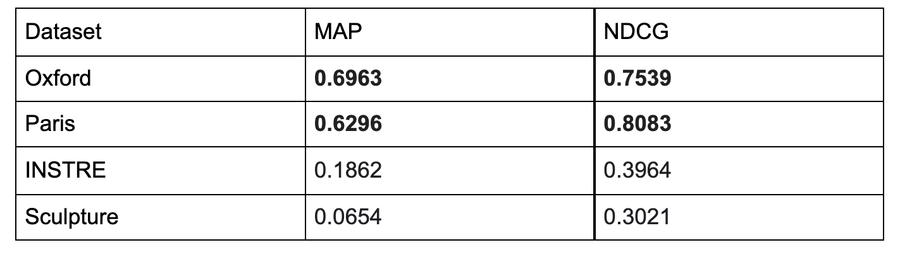</td>
    <td>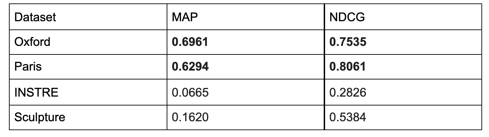</td>
    
  </tr>
 </table> 
 
  </div>   

                               Fig 12. DL BOW and Faster-RCNN Model Results
   <div align="center">

<table>
  <tr>
    <td>Cosine Similarity Results</td>
    <td>Weighted Cosine Similarity Results</td>
    
  </tr>
  <tr>
    <td>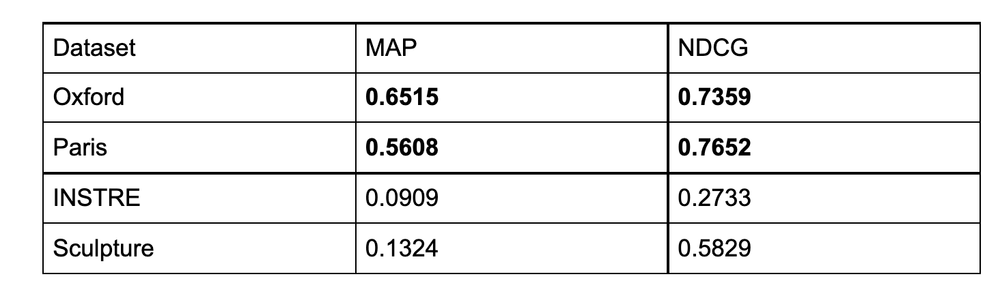</td>
    <td>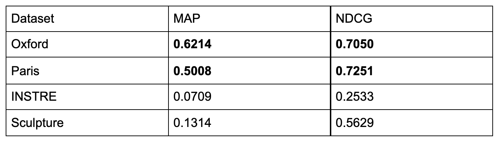</td>
    
  </tr>
 </table> 
 
  </div>  

                               Fig 13.Sculpture Dataset Results
<div align="center">
<table>
  <tr>
    <td>Model</td>
    <td>Query Image</td>
    <td>Top Results</td>
    
  </tr>
  <tr>
    <td>ML Baseline</td>
    <td>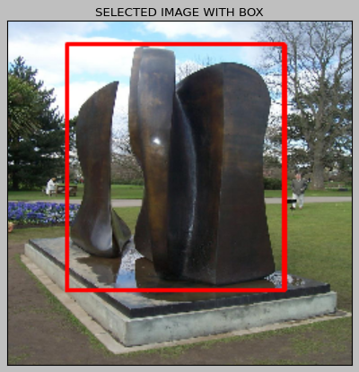</td>
    <td>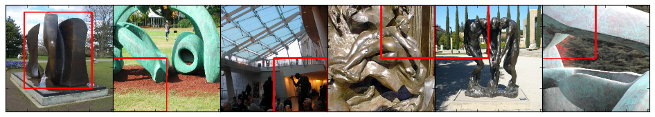</td>
    
  </tr>
  <tr>
    <td>DL BOW </td>
    <td></td>
    <td>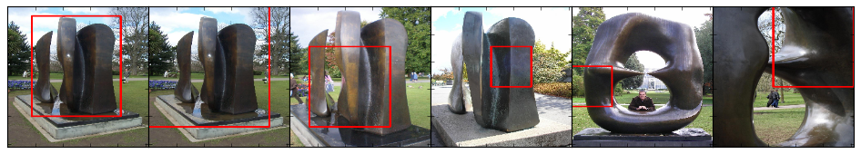</td>
    
  </tr>
  <tr>
    <td>DL BOW and Faster-RCNN</td>
    <td></td>
    <td>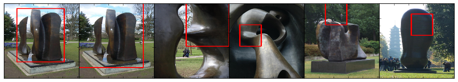</td>
  </tr>
 </table> 
  </div>  


                               Fig 14.Paris Dataset Results
<div align="center">
<table>
  <tr>
    <td>Model</td>
    <td>Query Image</td>
    <td>Top Results</td>
    
  </tr>
  <tr>
    <td>ML Baseline</td>
    <td>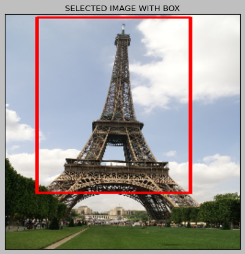</td>
    <td>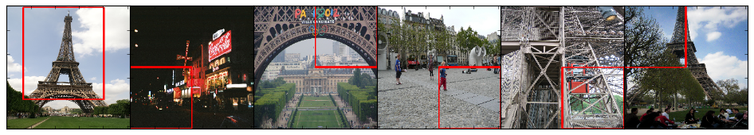</td>
    
  </tr>
  <tr>
    <td>DL BOW </td>
    <td></td>
    <td>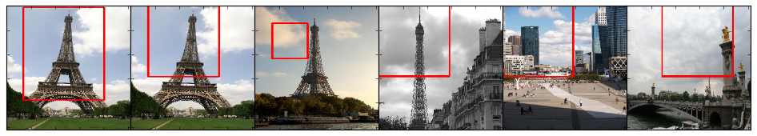</td>
    
  </tr>
  <tr>
    <td>DL BOW and Faster-RCNN</td>
    <td></td>
    <td>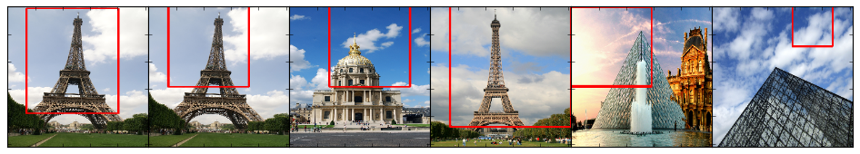</td>
  </tr>
 </table> 
  </div>  

  
                               Fig 15.Oxford Dataset Results
<div align="center">
<table>
  <tr>
    <td>Model</td>
    <td>Query Image</td>
    <td>Top Results</td>
    
  </tr>
  <tr>
    <td>ML Baseline</td>
    <td>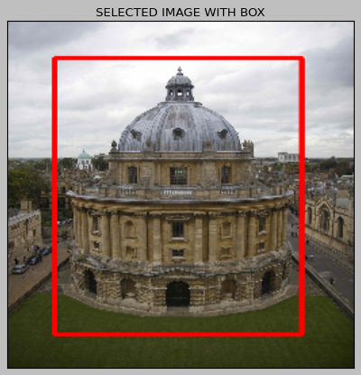</td>
    <td>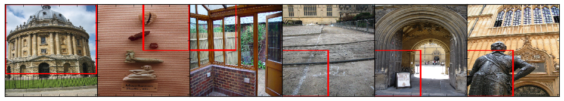</td>
    
  </tr>
  <tr>
    <td>DL BOW </td>
    <td></td>
    <td>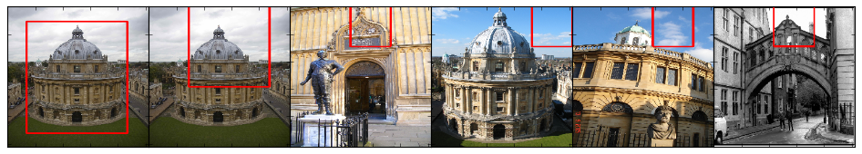</td>
    
  </tr>
  <tr>
    <td>DL BOW and Faster-RCNN</td>
    <td></td>
    <td>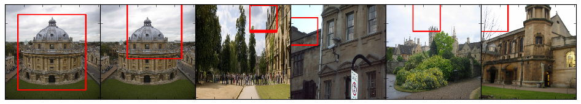</td>
  </tr>
 </table> 
  </div>  

                               Fig 16.Instre Dataset Results
<div align="center">
<table>
  <tr>
    <td>Model</td>
    <td>Query Image</td>
    <td>Top Results</td>
    
  </tr>
  <tr>
    <td>ML Baseline</td>
    <td>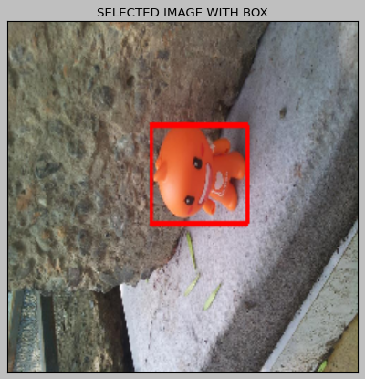</td>
    <td>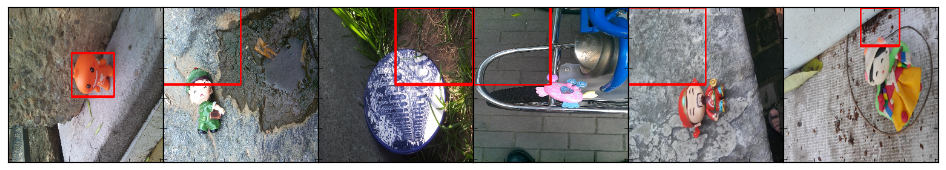</td>
    
  </tr>
  <tr>
    <td>DL BOW </td>
    <td></td>
    <td>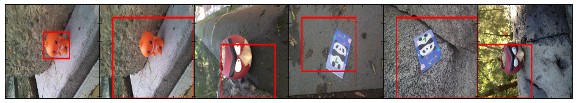</td>
    
  </tr>
  <tr>
    <td>DL BOW and Faster-RCNN</td>
    <td></td>
    <td>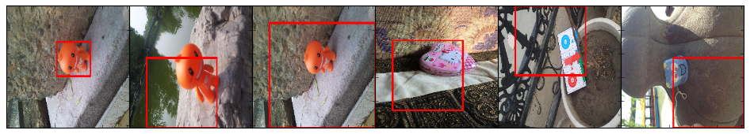</td>
  </tr>
 </table> 
  </div>  
  

## Code Instructions

### Setup 
- For dependencies related to this project, requirements.txt files have been provided for each model. 
- All dataset images and trained files can be found [here](https://drive.google.com/drive/folders/1dv7hz0pRfg3dmwVXgROKX3ZVuF2emU6A?usp=sharing) for each model respectively. Trained files for each model contains pickled files for each dataset per model.    
- All datasets can be downloaded from [here](https://drive.google.com/file/d/1CfpALYY6ui9pecG4uMzMe8A1kAcwWkkG/view?usp=sharing). 
- Download trained files per model using link given in model_folder/model_name_trained_files.txt.


## Usage 
- For each model all required files used for image retrieval are pickled and link provided to download them in model_folder/model_name_trained_files.txt. 
- **To replicate the required results download dataset and trained files per model and change path to self.all_original_images(path where all original images present for particular dataset) and others folder per dataset (others folder per dataset containes all required trained files) for Faster RCNN also change path of ranking_save_folder (contains global ranking for each dataset for each image in it)**.
  
- To run required model 
    - Download all datasets and set path self.all_original_images 
      to where all images are present for a particular dataset. 
    ```
    class Args():
        def __init__(self,data_path,dataset):
            self.train_f = os.path.join(data_path,'all_img_features.pkl')
            self.train_name =  os.path.join(data_path,'all_img_names.pkl')
            self.img_dict = os.path.join(data_path,'data.pkl')
            self.Hist_all = os.path.join(data_path,'Hist_all')
            self.train_amap = os.path.join(data_path,'assignment_map_250.pkl')
            self.k_mean_centers = os.path.join(data_path,'k_mean_centers.pkl')
            self.ground_truth = os.path.join(data_path,dataset +'_GT_final')
            self.ranking_one_path = os.path.join(data_path)
            self.datasetName = dataset
            self.all_original_images = '/content/drive/MyDrive/SUB/PROJECTS/IR_final/datasets/all_images/'+ dataset +'/' 

    ```
    - Change path for others for each dataset respectively. 
    ```
    my_paths = Args('/content/drive/MyDrive/SUB/PROJECTS/IR_final/models/baseline_dl_model /oxford/others','oxford')

    ```
    - For Faster RCNN model also provide the path for ranking_save_folder which contains global ranking for each query image. All other pickled files are same for faster RCNN and DL Bag of Words model.
    ```
    class f_Args():
        def __init__(self,ranking_save_folder):
            self.ranking_save_folder = ranking_save_folder
    ```

## Interpretation of Results
- Bag of Visual words Dl model outperforms all the other models but
  performing KNN to find the visual words is computation expensive.
  Also, there is a trade off between larger KNN centers and time required to perform KNN. 
- Histograms produced by Dl Bag of Visual words are sparse and high dimensional but tend to give better performance because of larger details captured due to high dimensionality. 
- Overall cosine similarity performs better compared to weighted cosine similarity. 
- Future work related to this project can be 
  - We can use LSTM based features with attention mechanisms, to filter and remember useful feature representation  from  the  images. 
  - We can meta train our models on different datasets,so that feature extractor model can generalize itself to images of different domains and provide more robust feature maps.  


## References

1. [Finding Bag Of Words using SIFT](https://medium.com/@aybukeyalcinerr/bag-of-visual-words-bovw-db9500331b2f)
2. [Bags of Local Convolutional Features for Scalable Instance Search](https://arxiv.org/pdf/1604.04653.pdf) 
3. [Faster R-CNN Features for Instance Search](https://www.cv-foundation.org/openaccess/content_cvpr_2016_workshops/w12/papers/Salvador_Faster_R-CNN_Features_CVPR_2016_paper.pdf)
4. [Instance Retrieval using Faster-RCNN](https://github.com/imatge-upc/retrieval-2016-deepvision)


## Project Team Members

1. Akanksha Shrimal
2. Shivam Sharma 
3. Shivank Agahari 
4. Pradeep Kumar
5. Sudha Kumari  

